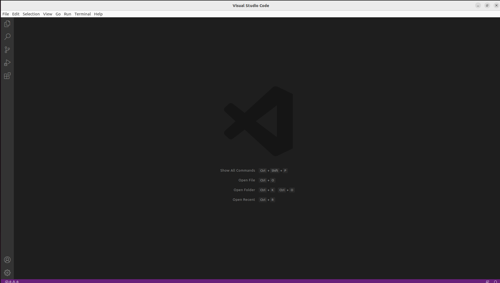

# oop-lab 0

**Smocvin Denis, FAF-212**

So, here is what I did.

## 1. Install Ubuntu

I installed Ubuntu. And actually I had fun from the start, because as I have windows 11, my BitLocker was automatically set and when I installed Ubuntu from the flash drive it told me I had to turn it off.

Well, I restarted the laptop and tried to boot windows and guess what... it asked me the BitLocker recovery key. I had a **mini heart attack**, because I've never heared of it before that day. Had to sweat a little to find it, but everything is alright though. Waited some good amount of time for windows to deccrypt almost 500GB of data.

Here is the trophy:

## 2 Zsh and friends

Next, I had to install ZSH, oh-my-zsh, git, gcc, vscode (ide of choice).
Nothing hard, here are some snippets.

## 3 Git and make

I installed Git, made a hello-world c program and pushed it to a remote repository. Here are some snippets:

The makefile in action:

And this is some git in action:

Hope you liked it :)
